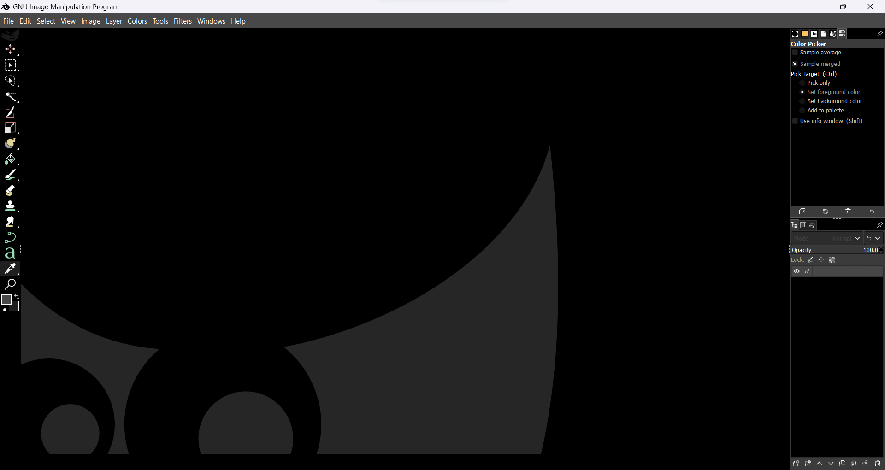

# AMOLED-ish theme for GIMP 2.10
 

A black, clean theme for GIMP 2.10 based on default dark theme.

## Installation
1. Clone a git repo onto your computer.  
2. Copy folder <code>amoledish</code> to <code>C:\Program Files\GIMP 2\share\gimp\2.0\themes</code>
3. Run GIMP and go to <code>Edit > Preferences > Themes</code> and pick amoledish.
4. Here you go.

## Issues to repair
- Make scrollbar more visible
- Remove some remnant of non-completely dark elements

## Credits
- OmoHex 
- Benoit Touchette (for creator of default dark theme)
